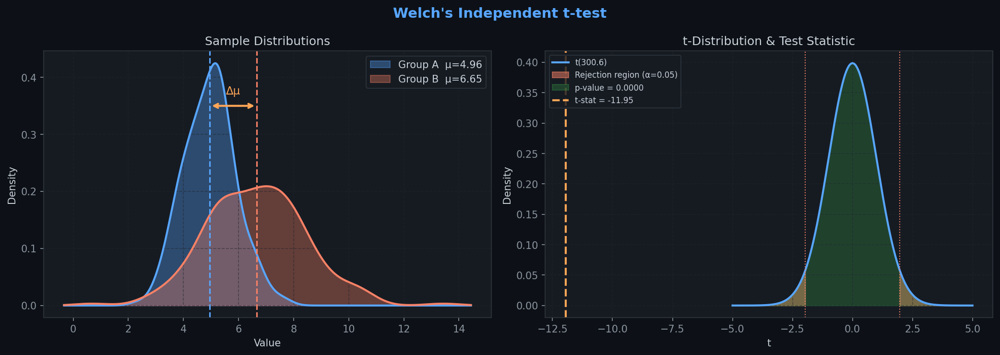
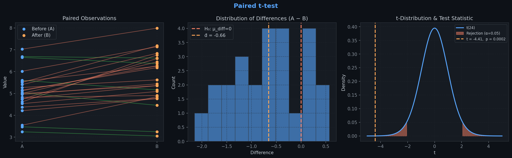
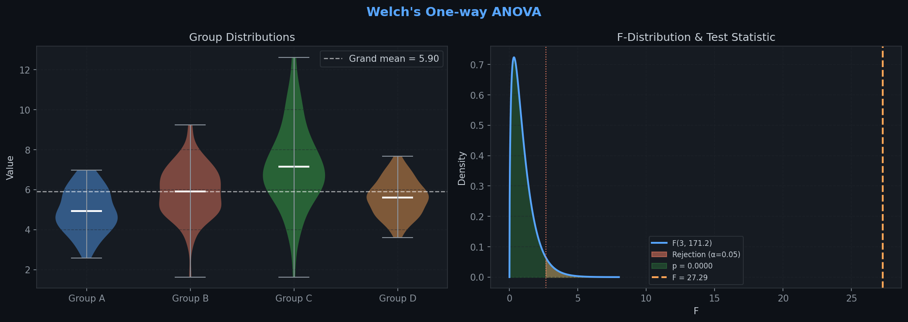
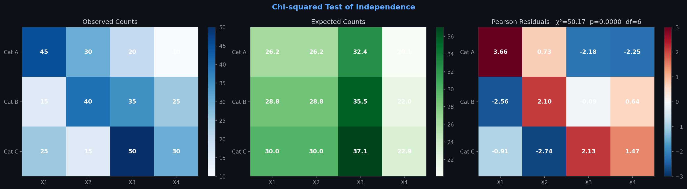
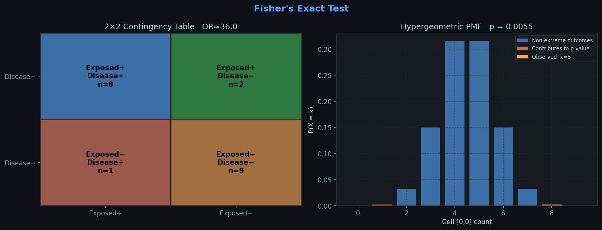
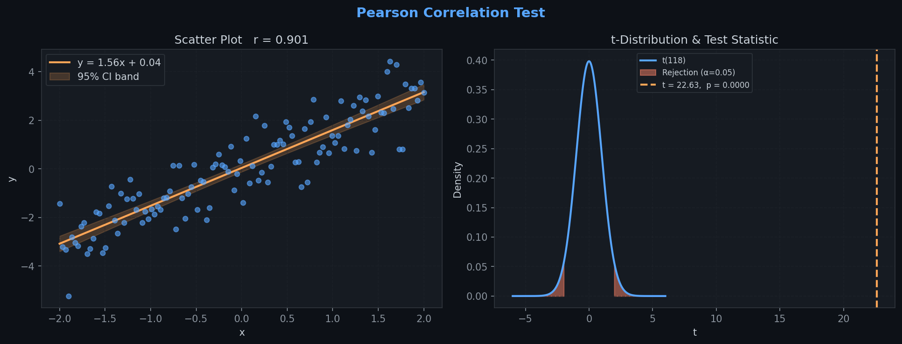
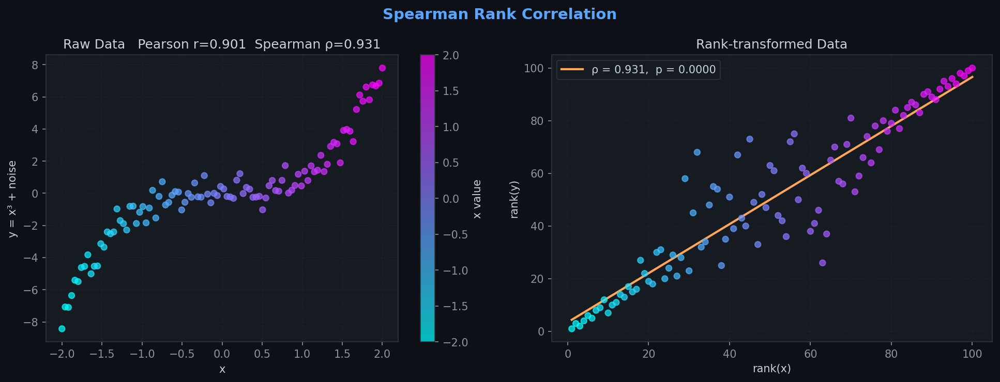
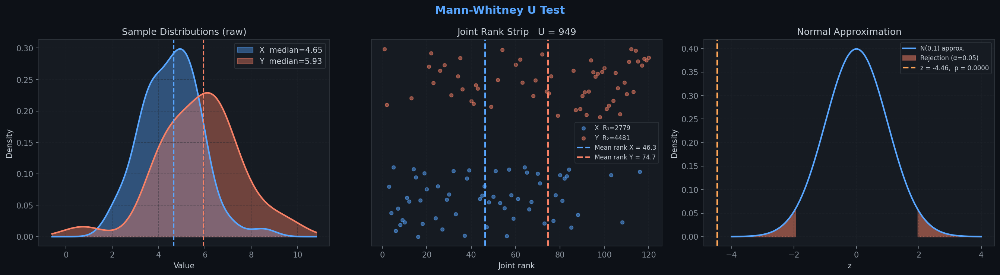
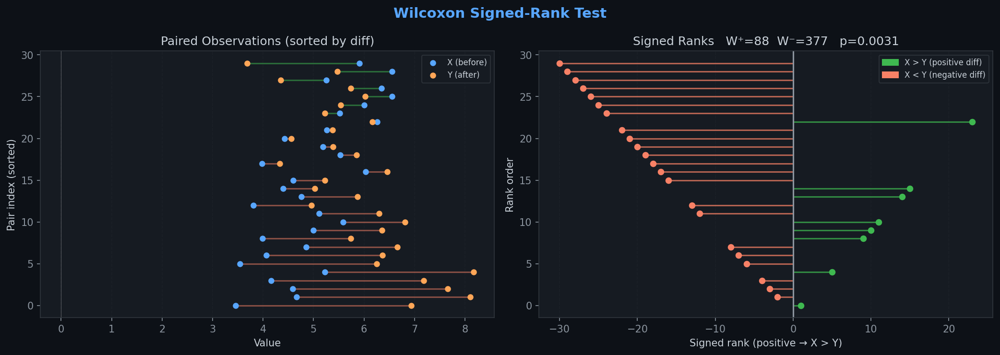
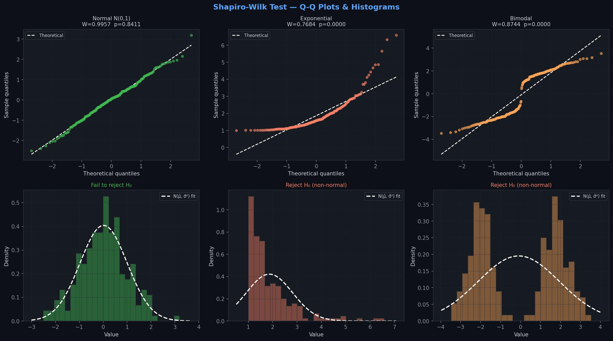

# Hypothesis Tests from Scratch

Ground-up Python implementations of ten classical hypothesis tests, each verified against **scipy.stats** and accompanied by a bespoke visualisation.
All maths is self-contained — no external stats libraries are used in the implementations themselves.

---

## Contents

| # | Test | Use case |
|---|------|----------|
| 1 | [Welch's Independent t-test](#1-welchs-independent-t-test) | Compare means of two independent groups with unequal variances |
| 2 | [Paired t-test](#2-paired-t-test) | Compare means of two matched / repeated-measure groups |
| 3 | [Welch's One-way ANOVA](#3-welchs-one-way-anova) | Compare means across ≥ 3 independent groups |
| 4 | [Chi-squared Test of Independence](#4-chi-squared-test-of-independence) | Test association between two categorical variables |
| 5 | [Fisher's Exact Test](#5-fishers-exact-test) | Exact association test for small 2×2 contingency tables |
| 6 | [Pearson Correlation](#6-pearson-correlation) | Test linear association between two continuous variables |
| 7 | [Spearman Rank Correlation](#7-spearman-rank-correlation) | Test monotonic association (non-parametric) |
| 8 | [Mann-Whitney U Test](#8-mann-whitney-u-test) | Non-parametric comparison of two independent samples |
| 9 | [Wilcoxon Signed-Rank Test](#9-wilcoxon-signed-rank-test) | Non-parametric comparison of two paired samples |
| 10 | [Shapiro-Wilk Test](#10-shapiro-wilk-test) | Test whether a sample comes from a normal distribution |

---

## 1. Welch's Independent t-test

**H₀:** μ₁ = μ₂ — the two population means are equal.

### Test statistic

$$t = \frac{\bar{x}_1 - \bar{x}_2}{\sqrt{\dfrac{s_1^2}{n_1} + \dfrac{s_2^2}{n_2}}}$$

### Degrees of freedom (Welch-Satterthwaite)

$$df = \frac{\left(\dfrac{s_1^2}{n_1} + \dfrac{s_2^2}{n_2}\right)^2}{\dfrac{(s_1^2/n_1)^2}{n_1-1} + \dfrac{(s_2^2/n_2)^2}{n_2-1}}$$

Distribution: **t(df)**



---

## 2. Paired t-test

**H₀:** μ_diff = 0 — the mean of the pairwise differences is zero.

Let $d_i = x_i - y_i$.

### Test statistic

$$t = \frac{\bar{d}}{s_d / \sqrt{n}}, \qquad df = n - 1$$

Distribution: **t(n − 1)**



---

## 3. Welch's One-way ANOVA

**H₀:** μ₁ = μ₂ = … = μₖ — all group means are equal.

### Weights and weighted grand mean

$$w_i = \frac{n_i}{s_i^2}, \qquad \bar{x}_w = \frac{\sum w_i \bar{x}_i}{\sum w_i}$$

### Test statistic

$$F = \frac{\displaystyle\sum_{i=1}^{k} w_i(\bar{x}_i - \bar{x}_w)^2 \;/\; (k-1)}{1 + \dfrac{2(k-2)}{k^2-1} \displaystyle\sum_{i=1}^{k} \dfrac{(1 - w_i/\sum w_i)^2}{n_i - 1}}$$

### Degrees of freedom

$$df_1 = k - 1, \qquad df_2 = \frac{k^2 - 1}{3\,\displaystyle\sum_i \dfrac{(1 - w_i/\sum w_i)^2}{n_i - 1}}$$

Distribution: **F(df₁, df₂)**



---

## 4. Chi-squared Test of Independence

**H₀:** The row variable and column variable are independent.

### Expected counts

$$E_{ij} = \frac{R_i \cdot C_j}{N}$$

where $R_i$ is the $i$-th row total, $C_j$ is the $j$-th column total, and $N$ is the grand total.

### Test statistic

$$\chi^2 = \sum_{i,j} \frac{(O_{ij} - E_{ij})^2}{E_{ij}}, \qquad df = (r-1)(c-1)$$

Distribution: **χ²(df)**
*Assumption: all E_ij ≥ 5. Use Fisher's exact test for small 2×2 tables.*



---

## 5. Fisher's Exact Test

**H₀:** Odds ratio = 1 — no association between the two binary variables.

Computes exact hypergeometric probabilities for all 2×2 tables sharing the observed marginal totals:

$$P(X = k) = \frac{\dbinom{K}{k}\dbinom{N-K}{n_1-k}}{\dbinom{N}{n_1}}$$

where $N$ = grand total, $K$ = column-1 total, $n_1$ = row-1 total.

The **two-sided** p-value sums all table probabilities ≤ P(observed).

Distribution: **Hypergeometric** (exact — no approximation needed).



---

## 6. Pearson Correlation

**H₀:** ρ = 0 — no linear association between x and y.

### Correlation coefficient

$$r = \frac{\sum(x_i - \bar{x})(y_i - \bar{y})}{\sqrt{\sum(x_i-\bar{x})^2}\sqrt{\sum(y_i-\bar{y})^2}}$$

### Test statistic

$$t = r\sqrt{\frac{n-2}{1-r^2}}, \qquad df = n - 2$$

Distribution: **t(n − 2)**



---

## 7. Spearman Rank Correlation

**H₀:** ρₛ = 0 — no monotonic association between x and y.

1. Replace observations with **average ranks** (ties share the mean rank).
2. Compute Pearson's *r* on the ranked data — this equals ρₛ.
3. Apply the same t-transformation as Pearson:

$$t = \rho_s\sqrt{\frac{n-2}{1-\rho_s^2}}, \qquad df = n - 2$$

Distribution: **t(n − 2)** *(large-sample approximation; exact when no ties)*



---

## 8. Mann-Whitney U Test

**H₀:** P(X > Y) = 0.5 — the two distributions are identical.

### U statistic

$$U_1 = R_1 - \frac{n_1(n_1+1)}{2}$$

where $R_1$ is the rank-sum of group X in the joint ranking.

### Large-sample normal approximation (with tie correction)

$$\mu_U = \frac{n_1 n_2}{2}, \qquad \sigma_U^2 = \frac{n_1 n_2}{12}\left[(N+1) - \frac{T}{N(N-1)}\right]$$

$$T = \sum_{\text{ties}} (t_k^3 - t_k), \qquad z = \frac{U_1 - \mu_U - \tfrac{1}{2}\text{sgn}(U_1-\mu_U)}{\sigma_U}$$

Distribution: **N(0, 1)**



---

## 9. Wilcoxon Signed-Rank Test

**H₀:** The distribution of differences is symmetric around zero.

1. Compute $d_i = x_i - y_i$; discard zeros.
2. Rank $|d_i|$ with average-rank tie handling.
3. $W^+ = \sum \text{ranks where } d_i > 0$, $\quad W^- = \sum \text{ranks where } d_i < 0$.

### Large-sample normal approximation (with tie correction)

$$\mu_W = \frac{n(n+1)}{4}, \qquad \sigma_W^2 = \frac{n(n+1)(2n+1)}{24} - \frac{T}{48}$$

$$z = \frac{W - \mu_W - \tfrac{1}{2}\text{sgn}(W - \mu_W)}{\sigma_W}$$

Distribution: **N(0, 1)**



---

## 10. Shapiro-Wilk Test

**H₀:** The sample is drawn from a normal distribution.

### Test statistic

$$W = \frac{b^2}{S^2}, \quad b = \sum_{i=1}^{\lfloor n/2 \rfloor} a_i\,(x_{(n+1-i)} - x_{(i)}), \quad S^2 = \sum(x_i - \bar{x})^2$$

Weights $a_i$ use Blom's (1958) approximation for expected normal order statistics:

$$m_i = \Phi^{-1}\!\left(\frac{i - 0.375}{n + 0.25}\right), \qquad a_i = \frac{m_{n+1-i}}{\|m\|}$$

### P-value (Royston 1992)

Under H₀, $\log(1 - W)$ is approximately normally distributed:

$$y = \log(1-W), \quad z = \frac{y - \mu}{\sigma}, \quad p = 1 - \Phi(z)$$

where $\mu$ and $\sigma$ are polynomial functions of $\log n$.

$W \in (0,1]$ — values close to 1 support normality.



---

## Project structure

```
Hypothesis-Tests/
├── Hypothesis-Tests.ipynb   # implementations + visualisations
├── plots/                   # exported plot PNGs
└── README.md
```

## Dependencies

```
numpy
scipy
matplotlib
```
